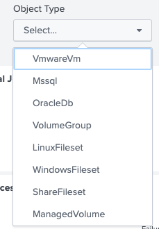
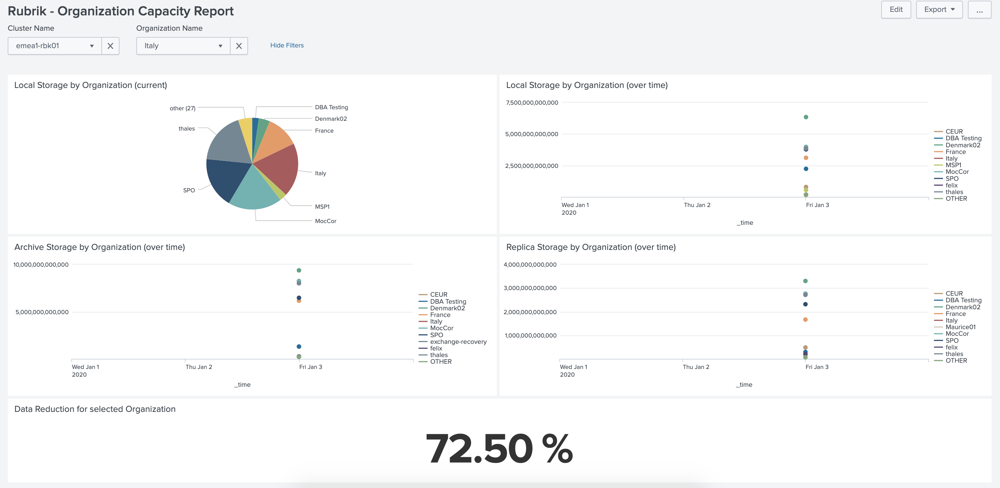

# Rubrik Splunk Add-On: Custom Dashboard Guide

## Overview

This document is intended to provide example searches and ideas for customers wishing to customise dashboards in Splunk using the Rubrik Splunk application.

The application provides some example dashboards out of the box, but many customers wish to have more specific data presented in a visual format. Here we discuss some ideas for such customisations, as well as provide sample searches for these ideas, and some guides to creating dashboards for data inputs which do not have out of the box dashboards provided.

## Per-Object Type Reporting Using Dashboard Inputs

This describes adding a dropdown to the dashboard to filter the resultant panels based on object type.

### Adding an object type dropdown

The following dropdown can be added to the 'Job History Dashboard' dashboard:



The following search string can be used to generate this list:

```none
| from datamodel:"rubrik_dataset_backup_job_events" | where clusterName=="$clusterName$" |  table objectType | dedup objectType
```

This input needs to be given a token name, for the remainder of this example we will use the value `objectType` (this is set up during creation of the dashboard input).

### Using the input to feed searches

Now the input is set up, it can be used to feed searches in the other panels in the dashboard. The pre-created searches can be modified by adding a `where` clause to the query. An example of this is below for the 'Last 24 Hours Success Percentage' panel:

```none
| from datamodel:"rubrik_dataset_backup_job_events" | where clusterName=="$clusterName$" | where objectType=="$objectType$" | stats count(eval(eventStatus="Success")) as Success count(eval(eventStatus=="Failure")) as Failure | eval percent_difference=((Success/(Success+Failure))*100) | fields percent_difference
```

From this, we can see the clause for using the input is:

```none
where objectType=="$objectType$"
```

This can be added in-line to the existing query.

## Managed Volume Summary Dashboard

This describes creating a dashboard from the 'Rubrik - Managed Volume Summary' Data Input provided as part of the Rubrik Splunk application. A screenshot of the produced dashboard is shown below:


### Adding a cluster dropdown

Create a new dashboard, and add a dropdown input type to the dashboard with the following search string:

```none
| from datamodel:"rubrik_dataset_managed_volume_summary" | table clusterName | dedup clusterName
```

This input needs to be given a token name, for the remainder of this example we will use the value `clusterName` (this is set up during creation of the dashboard input).

### Adding panels

The below describes the panels shown on the screenshot above.

#### Count of Managed Volumes

Query:

```none
| from datamodel:"rubrik_dataset_managed_volume_summary" | where clusterName=="$clusterName$" | head 1 | stats max(count)
```

Visualisation Type: Single Value

#### Managed Volume Breakdown by Protocol

Query:

```none
| from datamodel:"rubrik_dataset_managed_volume_summary"  | where clusterName=="$clusterName$" | head 1  | stats max(nfs) as NFS, max(smb) as SMB  | transpose
```

Visualisation Type: Pie Chart

#### Unexported Managed Volumes

Query:

```none
| from datamodel:"rubrik_dataset_managed_volume_summary"  | where clusterName=="$clusterName$" | head 1 | stats max(count) as Count max(exported) as Exported | eval nonExported = Count - Exported | fields nonExported
```

Visualisation Type: Single Value

#### Writable Managed Volumes

Query:

```none
| from datamodel:"rubrik_dataset_managed_volume_summary"  | where clusterName=="$clusterName$" | head 1 | stats max(nfs) as NFS, max(smb) as SMB  | transpose
```

Visualisation Type: Single Value

## Organization Capacity Report Dashboard

This describes creating a dashboard from the 'Rubrik - Managed Volume Summary' Data Input provided as part of the Rubrik Splunk application. A screenshot of the produced dashboard is shown below:



### Adding a cluster dropdown

Create a new dashboard, and add a dropdown input type to the dashboard with the following search string:

```none
| from datamodel:"rubrik_dataset_org_capacity" | table cluster_name | dedup cluster_name
```

This input needs to be given a token name, for the remainder of this example we will use the value `cluster_name` (this is set up during creation of the dashboard input).

### Adding a organization dropdown

Add a dropdown input type to the dashboard with the following search string:

```none
| from datamodel:"rubrik_dataset_org_capacity" | where cluster_name="$cluster_name$" | table Organization | dedup Organization
```

This input needs to be given a token name, for the remainder of this example we will use the value `org_name` (this is set up during creation of the dashboard input).

### Adding panels

The below describes the panels shown on the screenshot above.

#### Local Storage by Organization (current)

Query:

```none
| from datamodel:"rubrik_dataset_org_capacity" | where cluster_name="$cluster_name$" and Organization != "Global" | streamstats count by Organization | where count=1 | chart max(LocalStorage) by Organization
```

Visualisation Type: Pie Chart

#### Local Storage by Organization (over time)

Query:

```none
| from datamodel:"rubrik_dataset_org_capacity" | where Organization != "Global" and cluster_name="$cluster_name$" | timechart span=1d max(LocalStorage) by Organization
```

Visualisation Type: Line Chart

#### Archive Storage by Organization (over time)

Query:

```none
| from datamodel:"rubrik_dataset_org_capacity" | where Organization != "Global" and cluster_name="$cluster_name$" | timechart span=1d max(ArchiveStorage) by Organization
```

Visualisation Type: Line Chart

#### Replica Storage by Organization (over time)

Query:

```none
| from datamodel:"rubrik_dataset_org_capacity"  | where Organization != "Global" and cluster_name="$cluster_name$" | timechart span=1d max(ReplicaStorage) by Organization
```

Visualisation Type: Line Chart

#### Data Reduction for selected Organization

Query:

```none
| from datamodel:"rubrik_dataset_org_capacity" | where Organization="$orgName$" and cluster_name="$cluster_name$" | sort -_time | head 1 | stats max(LocalDataReductionPercent) As dataReduction | eval data_reduction=(dataReduction*100)  | fields data_reduction
```

Visualisation Type: Single Value
